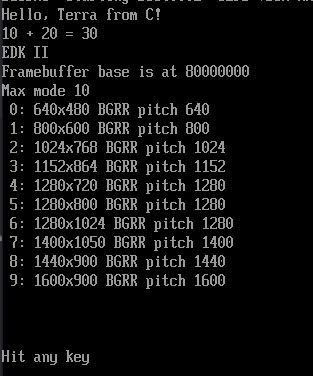

Hello EFI from Terra
====================

Proof of concept running [Terra](http://terralang.org/) code on the (U)EFI environment

You will need the Terra release for Linux (x86-64) https://github.com/zdevito/terra/releases/download/release-2016-03-25/terra-Linux-x86_64-332a506.zip and the GNU-EFI package, on Debian:

```bash
$ sudo apt-get install gnu-efi
```

There's a Dockerfile that should set things up to build it:

```bash
$ docker build . -t terra
$ docker run -v `realpath ./`:/hello -it terra
```

Then inside the container:
```bash
$ make
$ ./install_and_run.sh
```

You can have a look at install_and_run.sh for how to run this on QEmu. I suggest you copy OVMF.fd to /hello inside the container instead of installing the package containing the image on you local system.

You will also need to install QEmu and the ovmf package. Please open an Issue if I missed something.


